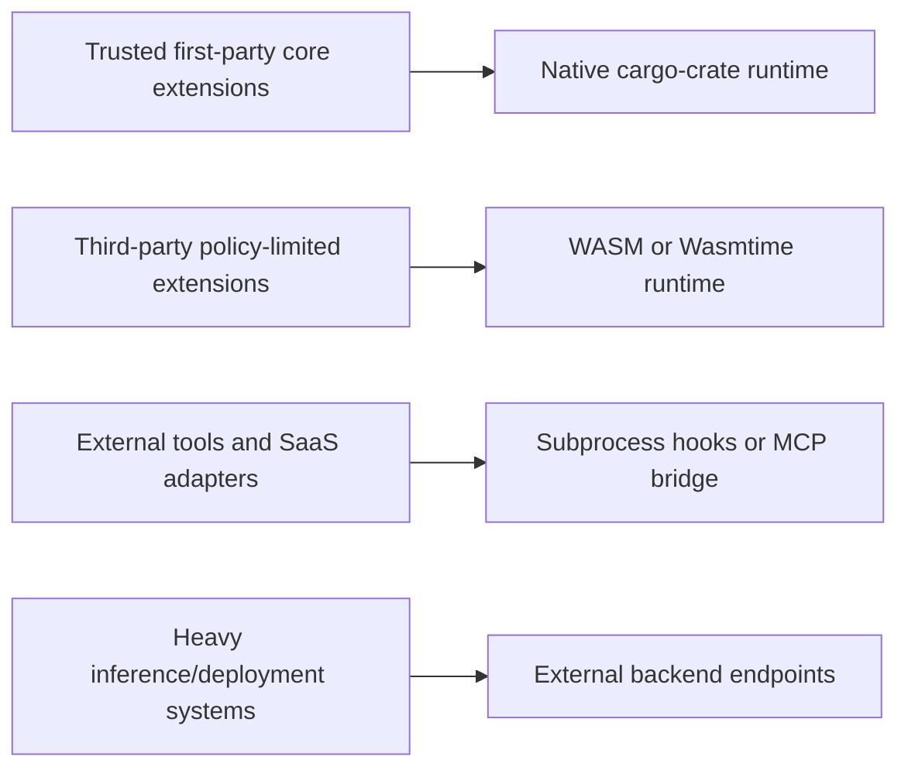
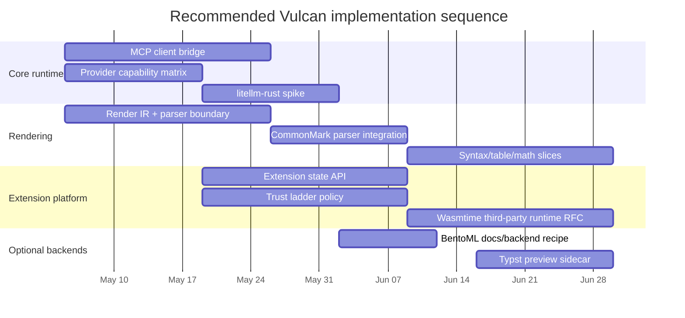

# Vulcan Technology Validation and Expansion Report

## Executive summary

I analyzed the enabled connectors first and confirmed the available connected sources as **GitHub** and **Linear**. I then reviewed the requested repositories — `yycholla/vulcan` and `yycholla/vulcan-extensions` — plus the linked GitHub and Linear issues that explicitly discuss future features, extension machinery, deployment targets, rendering, MCP, and backend options. The strongest architectural throughline is already clear in the repository itself: Vulcan is evolving toward a **daemon-owned runtime resource pool** with **session-local agent state**, **hook-driven extensibility**, and a **frontend/daemon split** that should keep expensive resources warm and let multiple frontends share one runtime. That is a strong basis for extensions and remote backends. fileciteturn13file0L1-L1 fileciteturn21file0L1-L1 fileciteturn22file0L1-L1

The most important near-term recommendation is to **separate “core runtime” choices from “ecosystem/runtime isolation” choices**. In practice, that means: keep **provider routing**, **MCP client bridging**, and **rendering basics** in core; use **extensions** for integrations, observability, and optional specialization; and treat **external inference stacks** such as BentoML, vLLM, llama.cpp, or OpenAI-compatible servers as backends that Vulcan calls rather than embeds. The repo and issue corpus itself points in this direction: MCP is explicitly framed as “built in first, extension later,” provider routing is framed as native runtime behavior, and the renderer work is broken into incremental slices rather than a single big dependency jump. fileciteturn35file0L1-L1 fileciteturn32file0L1-L1 fileciteturn40file0L1-L1

My highest-confidence implementation recommendations are these. First, **build the MCP bridge in core** with stdio JSON-RPC first, then layer managed hosting and remote/SSE later. Second, **pilot `litellm-rust` only as an optional adapter**, not as a wholesale replacement for Vulcan’s provider layer, because its current docs clearly show useful multi-provider routing but still early-stage 0.1.x maturity. Third, **treat BentoML as an external deployment recipe/backend, not a native dependency**, because its official docs show a substantial Python/cloud deployment platform that is useful for inference services but materially broader than Vulcan’s local-first Rust runtime. Fourth, **standardize the extension isolation story** around a trust ladder: native cargo-crate extensions only for trusted first-party/internal code, **WASM/Wasmtime** for safer third-party code, and subprocess/MCP for external tools and services. Fifth, **prefer `pulldown-cmark` as the default Markdown parser spike** and only escalate to `comrak` when AST-heavy transformations are actually required; the parser issues and the crates’ own docs strongly support that split. fileciteturn35file0L1-L1 fileciteturn43file0L1-L1 fileciteturn9file18L1-L1 fileciteturn18file0L1-L1 citeturn0search0turn0search8turn0search1turn0search3turn1search2turn1search5turn1search0

Two architectural caveats matter. The first is that Vulcan currently has **multiple extension models in flight at once**: inventory-registered Rust crates, a future package/store design for native/WASM/JS/Python extensions, and a separate subprocess-based hook spec in `vulcan-extensions`. That creates flexibility, but it also creates policy ambiguity, security ambiguity, and maintenance drag if all three are treated as equal citizens. The second is that the **rendering roadmap is valuable but dependency-sensitive**: image/media/mathematics/Typst/LaTeX all make sense as a layered renderer, but full LaTeX should remain isolated behind a sidecar or feature flag, while Typst preview and `ratatui-image` are the more practical first upgrades for a terminal-native product. fileciteturn16file0L1-L1 fileciteturn18file0L1-L1 fileciteturn24file0L1-L1 fileciteturn25file0L1-L1 fileciteturn40file0L1-L1 fileciteturn38file0L1-L1 fileciteturn9file20L1-L1

A final methodological note: the GitHub and Linear connectors frequently returned source files and issue bodies as **single-blob records** rather than line-expanded text. I therefore cite the exact file/issue artifact returned by the connector and identify the relevant section or issue title in prose when the connector did not expose reliable absolute line numbers. That is the main source-quality limitation in this pass. fileciteturn10file0L1-L1 fileciteturn13file0L1-L1 fileciteturn32file0L1-L1

## Source scope and extracted technology map

The reviewed repository artifacts explicitly show that Vulcan today already ships or plans a broad technical surface: a Rust terminal/TUI application, SQLite persistence with FTS5, an OpenAI-compatible provider layer, a daemon/gateway split, hook registries, extension registries, provider catalogs, Discord/gateway scaffolding, and a future extension platform. The extension-side repository adds a second concrete implementation model: subprocess hook handlers with `extension.toml`, JSON-over-stdin/stdout, and a Rust helper SDK. fileciteturn10file0L1-L1 fileciteturn19file0L1-L1 fileciteturn24file0L1-L1 fileciteturn25file0L1-L1 fileciteturn27file0L1-L1

The table below consolidates the **explicit technologies, systems, libraries, and papers** surfaced in the repos and retrieved issues. To keep the report readable, I group tightly related items into domain rows, but the cell contents enumerate the individual references that were explicitly named.

| Domain | Explicit technologies and systems named in repos/issues | Representative mention locations | Likely role in Vulcan |
|---|---|---|---|
| Provider routing and inference backends | `litellm-rust`, `genai`, `async-openai`, OpenAI-compatible APIs, OpenRouter, Anthropic, Gemini, xAI/Grok, Ollama, DeepSeek, BentoML, BentoCloud, vLLM, llama.cpp server, LiteLLM proxy, systemd, Docker/Compose, Nix, Modal | README provider/config sections; GitHub #575 / Linear YYC-316; GitHub #576 / Linear YYC-315 titles | Core provider layer for some items; external inference/deployment backends for others fileciteturn10file0L1-L1 fileciteturn43file0L1-L1 fileciteturn32file0L1-L1 fileciteturn9file18L1-L1 |
| Extension runtime and interoperability | MCP, JSON-RPC over stdio, SSE/remote MCP transport, cargo-crate extensions via `inventory`, subprocess hook handlers, WASM, Wasmtime, native dynamic libraries via `libloading`, JS via `deno_core`, Python, TOFU, GPG/Ed25519, seccomp-bpf, sandbox-exec | Linear YYC-168 / YYC-174; `src/extensions/api.rs`; `docs/features/developer-experience.md`; `docs/features/extension-store.md`; `vulcan-extensions/SPEC.md` | Built-in extension framework, trust/isolation policy, optional language runtimes fileciteturn35file0L1-L1 fileciteturn36file0L1-L1 fileciteturn16file0L1-L1 fileciteturn17file0L1-L1 fileciteturn18file0L1-L1 fileciteturn25file0L1-L1 |
| TUI and rendering | `ratatui`, `ratatui-image`, Kitty graphics protocol, iTerm2 inline images, Sixel, half-block fallback, CommonMark/GFM, `tui-markdown`, `pulldown-cmark`, `comrak`, `syntect`, `ansi-to-tui`, Typst, `typst-svg`, `typst-render`, `typst-pdf`, `typst-as-lib`, KaTeX, `katex-rs`, Tectonic, `texrender`, `latexmk` | README TUI section; Linear YYC-215; renderer epic/titles YYC-318/321/323/324/325 and GitHub #582–#589 | Direct feature work in core renderer, with richer media/math behind feature flags or sidecars fileciteturn10file0L1-L1 fileciteturn40file0L1-L1 fileciteturn9file11L1-L1 fileciteturn9file33L1-L1 fileciteturn38file2L1-L1 fileciteturn38file0L1-L1 fileciteturn9file20L1-L1 |
| Persistence, observability, integrations | SQLite, FTS5, Redis, PostgreSQL, local file memory backends, OpenTelemetry, Prometheus, Datadog, New Relic, GitHub Actions/GitLab, Slack, Discord, email, Vault, AWS/GCP/1Password, Linear/Jira/Notion, SQL read-only explorer | README; DX templates; extension-store example; Linear YYC-170 and YYC-176 | Mostly extensions or external backends, not first-slice native features fileciteturn10file0L1-L1 fileciteturn17file0L1-L1 fileciteturn18file0L1-L1 fileciteturn39file0L1-L1 fileciteturn37file0L1-L1 |
| Comparative systems and research inputs | `jcode`, `agentgrep`, Sandcastle, Graphite, RAG, ReAct, DSPy | GitHub #532; GitHub #608; external paper scan | Comparative architecture input; candidate ideas for orchestration, retrieval, and planning loops fileciteturn33file3L1-L1 citeturn3search0turn3search8turn3search3 |

From that extraction, the technologies that matter most for real product decisions are: **MCP**, **provider routing (`litellm-rust`-adjacent)**, **BentoML-class inference serving**, **WASM/Wasmtime versus native/plugin runtimes**, **Markdown parser choice**, **image/media rendering**, and **state/observability adapters**. Those are the items that materially affect Vulcan’s extension boundary, security boundary, and operational model. fileciteturn35file0L1-L1 fileciteturn43file0L1-L1 fileciteturn40file0L1-L1 fileciteturn17file0L1-L1 fileciteturn18file0L1-L1

## Suitability assessment by candidate class

The clearest decision boundary is whether a candidate belongs in **core**, **extension**, or **external backend**. The repository and issue corpus already implies a good split. Provider routing, MCP bridging, terminal rendering basics, session lifecycle, and safety/audit should stay in core because they define the runtime contract. Integrations such as observability, secret managers, SaaS connectors, and specialized data sources should be extensions. Heavy deployment platforms and inference servers should stay outside the process as backends Vulcan calls. fileciteturn13file0L1-L1 fileciteturn35file0L1-L1 fileciteturn37file0L1-L1

### Priority candidate comparison

| Candidate | Best fit | Integration complexity | Security posture | Performance / resource profile | Maintenance / maturity signal | Verdict |
|---|---|---:|---|---|---|---|
| MCP client bridge | **Direct feature in core** | Medium | Good if stdio-only and opt-in; risk rises with sampling/remote transports | Lightweight initial stdio bridge | Strong fit with Vulcan’s tool model; issues already scope it carefully | **Build now in core**; extensionize later fileciteturn35file0L1-L1 fileciteturn36file0L1-L1 |
| Managed MCP hosting | **Extension-adjacent control plane with core policy hooks** | Medium-high | Needs explicit policy on restart, templates, sampling, audit | Moderate supervisory overhead | Good second-phase feature only after bridge is stable | **Do after MCP client** fileciteturn36file0L1-L1 |
| `litellm-rust` | **Optional core adapter** | Medium | Acceptable if wrapped behind Vulcan’s own provider trait | Promising, but depends on chunk/tool parity | Docs show multi-provider routing, streaming, embeddings/images/video, but crate is still 0.1.x and marked under active development | **Pilot behind feature flag; do not replace core provider layer yet** fileciteturn43file0L1-L1 citeturn0search0turn0search8 |
| BentoML / BentoCloud | **External backend / deployment target** | Low for “consume an endpoint,” high for native embedding | Moves complexity outside Vulcan process, which is good; but adds Python/cloud surface | Strong for serving and autoscaling inference stacks | Official docs show a broad inference/deployment platform, including OpenAI-compatible serving with vLLM and extensive cloud deployment features | **Treat as backend/docs recipe, not native dependency** fileciteturn9file18L1-L1 citeturn0search1turn0search3 |
| `ratatui-image` | **Direct feature in core TUI, feature-gated** | Medium | Low security risk; terminal capability handling is the main challenge | Good enough for optional image paths; needs cache/throttle care | Issue design makes a strong case; docs confirm multiple backends | **Adopt for Phase 4 graphics, keep off by default where unsupported** fileciteturn40file0L1-L1 citeturn0search4turn0search6 |
| `pulldown-cmark` | **Direct feature in core renderer** | Low-medium | Very low | Fast/low-allocation pull parser | Mature, CommonMark-focused, pure-Rust, broad ecosystem use | **Best default parser spike** fileciteturn9file33L1-L1 citeturn1search2turn1search5turn1search7 |
| `comrak` | **Direct feature when AST control is required** | Medium | Very low | Heavier than pull-parser path | Official docs emphasize full CommonMark/GFM AST and transformations | **Use only if AST-level transforms outweigh parser cost** fileciteturn9file33L1-L1 citeturn1search0turn1search1 |
| Typst preview | **Optional extension-sidecar or feature-gated renderer** | Medium-high | Safer as sidecar/cache than always-on inline compiler | Moderate-to-heavy; should be cached | Strong strategic fit for rich documents; official docs confirm reliable PDF output | **Prefer before full LaTeX** fileciteturn38file0L1-L1 citeturn1search4 |
| Full LaTeX rendering | **External sidecar only** | High | Higher risk due toolchain size and runtime variability | Heavy; timeout/cache required | Valuable for niche cases, but poor default-terminal fit | **Defer; keep behind sidecar/feature flag if ever added** fileciteturn9file20L1-L1 |
| Wasmtime / WASM third-party runtime | **Extension runtime** | High | Much safer default than native dylib for untrusted third-party code | Good, with startup overhead acceptable for extension isolation | Official docs emphasize safe embedding, host-defined imports, and component-model direction | **Strategic target runtime for third-party extensions** fileciteturn17file0L1-L1 fileciteturn18file0L1-L1 citeturn2search0turn2search4 |
| Native dylib extensions via `libloading` | **Trusted first-party only** | Medium | Weakest isolation; repo docs explicitly warn untrusted code can compromise the process | Fastest path when trusted | Useful internally, dangerous as generalized marketplace model | **Restrict to trusted internal/first-party use** fileciteturn18file0L1-L1 |
| JS/Python in-process runtimes | **Avoid as first generalized extension path** | High | Large policy and supply-chain surface | Runtime overhead manageable, but security/maintenance dominate | Repository docs mention them, but they complicate the trust model sharply | **Prefer subprocess/MCP or WASM first** fileciteturn17file0L1-L1 fileciteturn18file0L1-L1 citeturn2search3 |
| Redis/PostgreSQL extension state backends | **External backends via adapter traits** | Medium | Good if isolated per-extension and policy-gated | Useful once state APIs exist | Issue scope itself says not first-slice | **Do later, after extension state API lands** fileciteturn39file0L1-L1 |

A second comparison, focused on the user-requested comparison attributes, is below. Because the official snippets available in this session did not expose every project’s license metadata, I mark those fields conservatively as **“not verified in this pass”** rather than guessing.

| Candidate | License status in this pass | Language / runtime | API style | Resource needs | Community / maturity | Recommendation |
|---|---|---|---|---|---|---|
| MCP | Standard / protocol, not a library license question | Protocol over stdio / JSON-RPC first | Tool/resource discovery + RPC | Low-medium | Strong ecosystem momentum; good fit for adapters | Core bridge now, managed hosting later fileciteturn35file0L1-L1 fileciteturn36file0L1-L1 citeturn0search7 |
| `litellm-rust` | Not verified in snippet | Rust | Unified routed client (`provider/model`) | Low-medium | **Growing but early**; official docs show active development and 0.1.x | Pilot only citeturn0search0turn0search8 |
| BentoML | Not verified in snippet | Python platform | Service/API and cloud deployment model | Medium-high | **Established** platform with broad deployment surface | Use as backend, not dependency citeturn0search1turn0search3 |
| `ratatui-image` | Not verified in snippet | Rust | Widget/backends for terminal graphics | Medium | **Niche but suitable**; issue says maintained and tracks ratatui | Adopt if feature-gated fileciteturn40file0L1-L1 citeturn0search4turn0search6 |
| `pulldown-cmark` | MIT verified in GitHub snippet | Rust | Pull parser | Low | **Mature / large** | Preferred default parser citeturn1search5turn1search2 |
| `comrak` | Not verified in snippet | Rust | Full AST parser | Medium | **Mature / capable** | Use only when AST manipulation matters citeturn1search0turn1search1 |
| Typst | Not verified in snippet | Typst toolchain / Rust ecosystem | Compile/render pipeline | Medium-high | **Growing** | Prefer for rich-doc previews before LaTeX citeturn1search4 |
| Wasmtime | Not verified in snippet | Rust / WASM runtime | Embedded runtime with host imports | Medium | **Established** | Best long-term third-party extension runtime citeturn2search0turn2search4 |

## Architecture audit and concrete improvements

Vulcan’s architecture has several real strengths. The strongest one is the **daemon-owned runtime resource pool**. The repo states that the daemon is supposed to own expensive shared resources — provider metadata, memory/cortex state, LSP processes, stores, and tool construction resources — while sessions remain conversation-scoped and single-flight. The implementation in `RuntimeResourcePool` already follows that direction: one shared `SessionStore`, run store, artifact store, orchestration store, LSP manager, extension registry, and extension audit log are kept at process scope and handed out by cheap `Arc` clones. That is exactly the right shape for a local-first agent that may later power multiple frontends. fileciteturn13file0L1-L1 fileciteturn21file0L1-L1 fileciteturn22file0L1-L1

The second strength is the **session-local extension boundary**. `src/extensions/api.rs` cleanly separates daemon-global registration (`DaemonCodeExtension`) from per-session instantiation (`SessionExtension`), which is a good fit with the glossary in `CONTEXT.md`: heavy adapters stay daemon-owned, while hooks/tools/providers become session-local and capability-aware. This is a better long-term direction than a flat global plugin registry because it preserves session-scoped trust, UI capability negotiation, and event fanout without forcing the whole process into one extension state space. fileciteturn16file0L1-L1 fileciteturn13file0L1-L1

The main structural weakness is that Vulcan currently has **three overlapping extension stories**: in-tree hook/registry APIs, a future package/store model that contemplates native/WASM/JS/Python loaders, and a separate subprocess wire spec in `vulcan-extensions`. All three are defensible independently, but together they create product ambiguity. The store design itself warns that native loading can compromise the host process and recommends WASM or child-process isolation for stronger security; the subprocess spec likewise says handlers run with the same OS-level trust as the user and explicitly leaves sandboxing out of scope for v0.1. In other words, the repository already contains the evidence that the trust boundary is not yet converged. fileciteturn18file0L1-L1 fileciteturn25file0L1-L1

That ambiguity matters because security posture, maintenance burden, and developer experience all depend on the runtime choice. A single, concrete trust ladder would simplify this:

This target shape fits the current repo evidence better than treating dylibs, JS/Python embeddings, subprocess handlers, and MCP as equivalent plugin mechanisms. It preserves performance for trusted internal functionality while giving third-party integrations safer defaults. fileciteturn16file0L1-L1 fileciteturn18file0L1-L1 fileciteturn25file0L1-L1 citeturn2search0turn2search4

There is also a maturation issue in runtime wiring. `DaemonState` still exposes an `apply_config_stub` reload path that only TOML-parses and bumps a counter; that is a good placeholder, but it means hot-reload semantics, provider reconfiguration, and runtime pool mutation are not yet operationally real. Given the architectural emphasis on a long-lived daemon, this is one of the highest-leverage areas to harden before adding many more backends. fileciteturn22file0L1-L1

The renderer path is another legitimate weakness, though a healthy one: the repo has correctly recognized that markdown rendering, wrapping, syntax highlighting, math, Typst, and LaTeX should be approached as **layered slices** instead of one dependency pile. The recommended implementation order is therefore: fix wrapping and parser boundary first, adopt a CommonMark parser second, add syntax highlighting and tables third, then math/Typst, and only then consider full LaTeX. That sequence is already encoded in the renderer epic and related issues, and it is the right one from a stability standpoint. fileciteturn9file11L1-L1 fileciteturn9file33L1-L1 fileciteturn38file2L1-L1 fileciteturn38file0L1-L1 fileciteturn9file20L1-L1

### Concrete improvements and migration strategies

| Improvement | Why it matters | Effort | Migration strategy |
|---|---|---:|---|
| Converge extension runtime policy into one trust ladder | Removes ambiguity between native/WASM/subprocess/MCP approaches | High | Freeze a formal policy: native for trusted internal crates, WASM for third-party, subprocess/MCP for external tools; explicitly de-scope generalized in-proc JS/Python until later fileciteturn18file0L1-L1 fileciteturn25file0L1-L1 |
| Promote MCP bridge to core feature | Best near-term ecosystem win with low conceptual risk | Medium | Implement stdio-only client, discovery, tool adaptation, and audit integration first; defer managed hosting and sampling to follow-on issues fileciteturn35file0L1-L1 fileciteturn36file0L1-L1 |
| Add provider capability matrix and optional `litellm-rust` adapter | Lowers bespoke provider burden without giving up Vulcan-specific semantics | Medium | Wrap behind existing provider trait; ship only parity subset first; keep in-tree provider as control | fileciteturn43file0L1-L1 citeturn0search0turn0search8 |
| Land render IR before heavy renderer deps | Prevents parser/rewrite churn in TUI/CLI/gateway rendering | Medium | Introduce renderer-neutral IR, adapt current parser, then replace parser backend incrementally | fileciteturn9file11L1-L1 |
| Keep extension state on SQLite first | Avoids premature distributed-store complexity | Low | Build extension-scoped persistence and migration layer on current store model; add Redis/Postgres adapters later | fileciteturn39file0L1-L1 |
| Add OpenTelemetry-compatible event export early | Gives observability without overcommitting to one vendor | Low-medium | Implement first-party event logger extension / exporter, then let vendor-specific backends stay outboard | fileciteturn17file0L1-L1 fileciteturn37file0L1-L1 |
| Harden config reload beyond stub parsing | Required for real long-lived daemon operations | Medium | Move provider/session rebuild logic behind explicit reload-safe boundaries in daemon and runtime pool | fileciteturn22file0L1-L1 |

## Additional promising additions from external sources

The most useful **unreferenced** additions I found were not “drop-in systems” so much as **research and framework ideas** that line up well with Vulcan’s planned extension and orchestration surfaces.

The first is **RAG as a principled architecture**, not just a keyword. The original Retrieval-Augmented Generation paper argues for combining parametric model knowledge with non-parametric retrieved memory for knowledge-intensive work. That maps directly onto Vulcan’s planned knowledge-store/stateful-extension/RAG ambitions and is a strong conceptual basis for any future retrieval extension API. In Vulcan terms, it supports keeping retrieval as a backend or extension surface rather than stuffing long-term knowledge into the system prompt by default. fileciteturn39file0L1-L1 fileciteturn37file0L1-L1 citeturn3search0turn3search6

The second is **ReAct-style interleaving of reasoning and action**. Vulcan already has turns, hooks, tool calls, safety pauses, live tool activity, and planned sub-agent/orchestration features. ReAct is relevant because it legitimizes a design in which planning and tool use are not separate “modes,” but part of a structured action loop. That makes it a better conceptual fit for Vulcan’s hook and turn-runner architecture than a purely “chat-completion wrapper” mental model. fileciteturn10file0L1-L1 fileciteturn13file0L1-L1 citeturn3search8

The third is **DSPy-style pipeline compilation and optimization**. DSPy is not a direct runtime dependency recommendation, but it is interesting for Vulcan’s future “playbooks,” “review flows,” and “Factory/Symphony” ideas because it treats LM pipelines as explicit, optimizable graphs instead of prompt blobs. For Vulcan, that suggests a future where playbooks or workflow graphs become first-class execution artifacts with tuning and evaluation loops, rather than just stored prompts. fileciteturn9file7L1-L1 citeturn3search3

Among concrete runtime technologies, **Wasmtime** deserves stronger strategic weight than it currently has in the issue set. The official docs emphasize safe embedding, explicit host-import surfaces, async support, and a clear component-model direction. Given the extension-store document’s own warning that native loading can compromise the process, Wasmtime is the best long-term answer for third-party extension execution if Vulcan wants a real marketplace or untrusted ecosystem. fileciteturn18file0L1-L1 citeturn2search0turn2search4

A more conservative scripting option, if Vulcan ever wants JavaScript-based extension authoring, is **not** to embed a JS runtime directly in first release. The safer path is to expose scripting through **MCP or subprocess contracts first**, or at most via a clearly permissioned runtime boundary. The Deno documentation is a useful signal here because it emphasizes secure defaults and explicit permissions; that is the right philosophy, but it still does not beat keeping scripting out-of-process for a first general extension platform. fileciteturn17file0L1-L1 fileciteturn18file0L1-L1 citeturn2search3

## Prioritized roadmap

The roadmap below prioritizes **foundational leverage** over feature count. The goal is to implement the highest-value surfaces first while keeping the trust model coherent.

### Recommended milestones

| Priority | Milestone | What to ship | Trade-offs and dependencies |
|---|---|---|---|
| Highest | **Core interoperability foundation** | MCP stdio client bridge, tool adaptation, audit integration, explicit config model | High user value, moderate engineering cost, lower risk than marketplace/runtime work; depends only on stable tool registry boundaries fileciteturn35file0L1-L1 |
| Highest | **Renderer stabilization** | Render IR boundary, parser spike, improved wrapping, then GFM/code/math slices | Necessary before rich media; prevents TUI churn and dependency sprawl later fileciteturn9file11L1-L1 fileciteturn9file33L1-L1 |
| High | **Extension state + policy layer** | Extension-scoped persistence API, capability manifest policy, cross-extension isolation tests | Enables real integrations without immediately needing Redis/Postgres or a store marketplace fileciteturn39file0L1-L1 |
| High | **Provider routing research spike** | Capability matrix plus optional `litellm-rust` adapter behind feature flag | Good upside, but only if chunk semantics, tool calls, and observability remain under Vulcan control fileciteturn43file0L1-L1 citeturn0search0turn0search8 |
| Medium | **Optional graphics/media path** | `ratatui-image`, terminal-capability detection, probe command, cache | Visible UX win, but only after render/model boundaries are stable fileciteturn40file0L1-L1 |
| Medium | **Inference backend recipes** | First documented external backends: OpenAI-compatible local endpoints, vLLM/llama.cpp/Ollama patterns, BentoML recipe | Valuable operationally, but best kept outside the core binary at first fileciteturn10file0L1-L1 citeturn0search1turn0search3 |
| Later | **Third-party extension runtime** | Wasmtime-based runtime after trust ladder policy is fixed | High strategic value, but should not land before extension policy and packaging are coherent fileciteturn18file0L1-L1 citeturn2search0turn2search4 |
| Later | **Full LaTeX and generalized JS/Python in-process loading** | Only if strong demand appears | Complexity and security cost are too high for current maturity level fileciteturn18file0L1-L1 fileciteturn9file20L1-L1 |

## Open questions and primary references

The biggest unresolved question is **which extension runtime becomes canonical**. Right now the evidence supports a three-tier trust model, but the codebase and docs still describe multiple overlapping futures. The second unresolved question is **how much provider logic Vulcan should centralize** versus delegate to a router like `litellm-rust`. The third is **whether image/media rendering remains a terminal-centric feature or becomes shared across TUI, CLI, and gateway output** once Render IR exists. Finally, I did not verify every external project’s license from primary sources in this session; where the official snippets did not surface license metadata, I marked it as unverified rather than guessing. fileciteturn16file0L1-L1 fileciteturn18file0L1-L1 fileciteturn43file0L1-L1 fileciteturn40file0L1-L1

Primary repository and issue references used in this report include the main repository README, the architectural `CONTEXT.md`, daemon/runtime-pool/extension API files, the `vulcan-extensions` README and SPEC, and the linked GitHub/Linear issues for MCP, extension state, first-party extension catalog ideas, provider routing, BentoML research, renderer work, and TUI graphics. fileciteturn10file0L1-L1 fileciteturn13file0L1-L1 fileciteturn21file0L1-L1 fileciteturn22file0L1-L1 fileciteturn16file0L1-L1 fileciteturn24file0L1-L1 fileciteturn25file0L1-L1 fileciteturn35file0L1-L1 fileciteturn36file0L1-L1 fileciteturn37file0L1-L1 fileciteturn39file0L1-L1 fileciteturn40file0L1-L1 fileciteturn43file0L1-L1

Primary external references used to validate suitability were official or primary documentation for `litellm-rust`, BentoML/BentoCloud, the Model Context Protocol specification, `ratatui-image`, `pulldown-cmark`, `comrak`, Typst PDF export, Wasmtime, plus the original RAG and ReAct papers and the DSPy paper page. citeturn0search0turn0search1turn0search3turn0search4turn0search7turn1search0turn1search2turn1search4turn1search5turn2search0turn2search4turn3search0turn3search8turn3search3